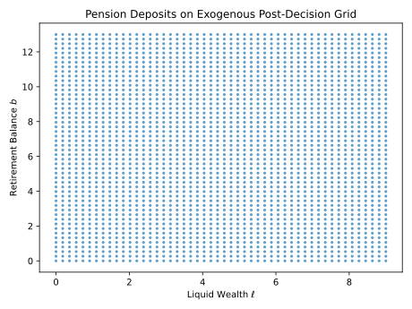
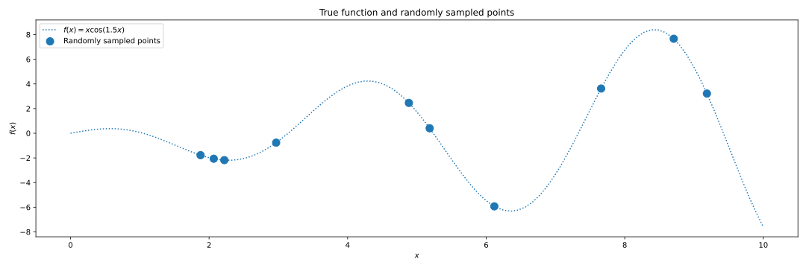
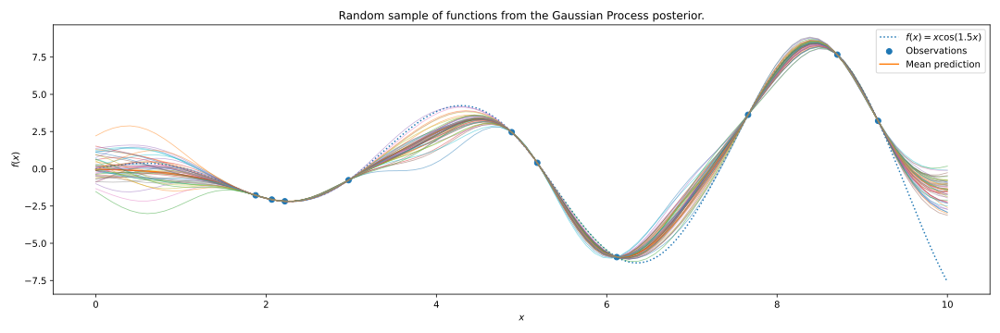
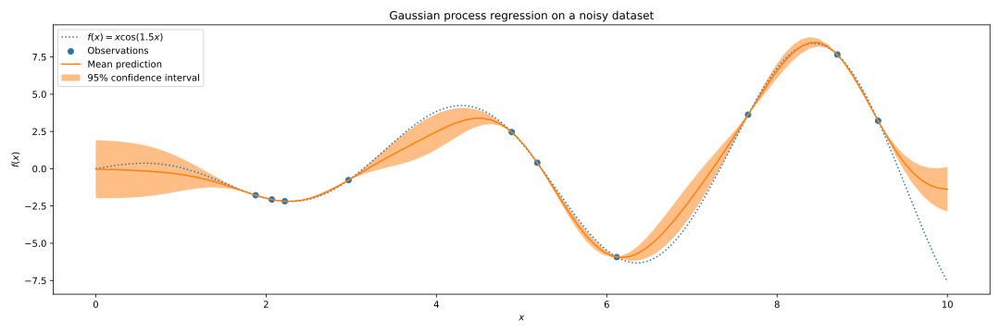

---
jupytext:
  cell_metadata_filter: all
  formats: ipynb,py:percent,md:myst
  notebook_metadata_filter: all
  text_representation:
    extension: .md
    format_name: myst
    format_version: 0.13
    jupytext_version: 1.14.6
kernelspec:
  display_name: Python 3 (ipykernel)
  language: python
  name: python3
language_info:
  codemirror_mode:
    name: ipython
    version: 3
  file_extension: .py
  mimetype: text/x-python
  name: python
  nbconvert_exporter: python
  pygments_lexer: ipython3
  version: 3.10.12
---

+++ {"slideshow": {"slide_type": "slide"}, "tags": []}

<h1 style="text-align:center"><strong>EGM$^n$: The Sequential Endogenous Grid Method</strong></h1>

By

<h1 style="text-align:center"><strong>Alan E. Lujan Solis</strong></h1>
<h2 style="text-align:center">The Ohio State University</h2>
<h2 style="text-align:center">Econ-ARK</h2>

<h3 style="text-align:center">H2: Computational Methods III</h3>
<h3 style="text-align:center">29th International Conference</h3>
<h3 style="text-align:center">Computing in Economics and Finance</h3>

Université Côte d’Azur – Nice, France

5 July 2023

$$
\newcommand{\DiscFac}{\beta}
\newcommand{\utilFunc}{\mathrm{u}}
\newcommand{\VFunc}{\mathrm{V}}
\newcommand{\Leisure}{Z}
\newcommand{\tShk}{\xi}
\newcommand{\util}{u}
\newcommand{\tShkEmp}{\theta}
\newcommand{\BLev}{B}
\newcommand{\CLev}{C}
\newcommand{\Ex}{\mathbb{E}}
\newcommand{\CRRA}{\rho}
\newcommand{\labShare}{\nu}
\newcommand{\leiShare}{\zeta}
\newcommand{\h}{h}
\newcommand{\bRat}{b}
\newcommand{\leisure}{z}
\newcommand{\cRat}{c}
\newcommand{\PLev}{P}
\newcommand{\vFunc}{\mathrm{v}}
\newcommand{\Rfree}{\mathsf{R}}
\newcommand{\wage}{\mathsf{w}}
\newcommand{\riskyshare}{\varsigma}
\newcommand{\PGro}{\Gamma}
\newcommand{\labor}{\ell}
\newcommand{\aRat}{a}
\newcommand{\mRat}{m}
\newcommand{\Rport}{\mathbb{R}}
\newcommand{\Risky}{\mathbf{R}}
\newcommand{\risky}{\mathbf{r}}
\newcommand{\vOpt}{\tilde{\mathfrak{v}}}
\newcommand{\vEnd}{\mathfrak{v}}
\newcommand{\vE}{{v}^{e}}
\newcommand{\vOptAlt}{\grave{\tilde{\mathfrak{v}}}}
\newcommand{\q}{\koppa}
\newcommand{\cEndFunc}{\mathfrak{c}}
\newcommand{\cE}{\cRat^{e}}
\newcommand{\xRat}{x}
\newcommand{\aMat}{[\mathrm{a}]}
\newcommand{\mEndFunc}{\mathfrak{m}}
\newcommand{\mE}{\mRat^{e}}
\newcommand{\mMat}{[\mathrm{m}]}
\newcommand{\tShkMat}{[\mathrm{\tShkEmp}]}
\newcommand{\zEndFunc}{\mathfrak{z}}
\newcommand{\lEndFunc}{\mathfrak{l}}
\newcommand{\bEndFunc}{\mathfrak{b}}
\newcommand{\bE}{\bRat^{e}}
\newcommand{\nRat}{n}
\newcommand{\dRat}{d}
\newcommand{\gFunc}{\mathrm{g}}
\newcommand{\xFer}{\chi}
\newcommand{\lRat}{l}
\newcommand{\wFunc}{\mathrm{w}}
\newcommand{\dEndFunc}{\mathfrak{d}}
\newcommand{\nEndFunc}{\mathfrak{n}}
\newcommand{\uFunc}{\mathrm{u}}
\newcommand{\TFunc}{\mathrm{T}}
\newcommand{\UFunc}{\mathrm{U}}
\newcommand{\WFunc}{\mathrm{W}}
\newcommand{\yRat}{y}
\newcommand{\XLev}{X}
\newcommand{\Retire}{\mathbb{R}}
\newcommand{\Work}{\mathbb{W}}
\newcommand{\error}{\epsilon}
\newcommand{\err}{z}
\newcommand{\kapShare}{\alpha}
\newcommand{\kap}{k}
\newcommand{\cTarg}{\check{c}}
\newcommand{\Decision}{\mathbb{D}}
\newcommand{\Prob}{\mathbb{P}}
$$

+++ {"slideshow": {"slide_type": "slide"}, "tags": []}

## The Endogenous Grid Method

- Simple
  - Inverted Euler equation
- Fast
  - No root-finding or optimization required
- Efficient
  - Finds exact solution at each gridpoint

- Limitations
  - Generally only works for one-dimensional problems/subproblems (nested)
  - Can result in unstructured grids
  - Non-convexities can be problematic

+++ {"slideshow": {"slide_type": "slide"}, "tags": []}

## EGM$^n$: The Sequential Endogenous Grid Method

- Simple
  - Inverted Euler equation
- Fast
  - No root-finding or optimization required
- Efficient
  - Finds exact solution at each gridpoint
- Multi-dimensional
  - Can be used for problems with multiple state variables and controls
- Unstructured Grids
  - New approach using Gaussian Process Regression
- Discrete Choices
  - Handle discrete choices with taste-shocks

+++ {"slideshow": {"slide_type": "slide"}, "tags": []}

## Consumption-Labor-Portfolio Choice Problem

Agent maximizes PDV of utility from consumption, leisure, and risky portfolio share

\begin{equation}
\VFunc_0(\BLev_0, \tShkEmp_0) = \max \Ex_{t} \left[ \sum_{n = 0}^{T-t} \DiscFac^{n} \utilFunc(\CLev_{t+n}, \Leisure_{t+n})  \right]
\end{equation}

Recursive Bellman equation in normalized form:

\begin{equation}
\begin{split}
    \vFunc_{t}(\bRat_{t}, \tShkEmp_{t}) & = \max_{\{\cRat_{t},
      \leisure_{t}, \riskyshare_{t}\}} \utilFunc(\cRat_{t}, \leisure_{t}) +
    \DiscFac \Ex_{t} \left[ \PGro_{t+1}^{1-\CRRA}
      \vFunc_{t+1} (\bRat_{t+1},
      \tShkEmp_{t+1}) \right] \\
    & \text{s.t.} \\
    \labor_{t} & = 1 - \leisure_{t} \\
    \mRat_{t} & = \bRat_{t} + \tShkEmp_{t} \wage \labor_{t} \\
    \aRat_{t} & = \mRat_{t} - \cRat_{t} \\
    \Rport_{t+1} & = \Rfree + (\Risky_{t+1} - \Rfree)
    \riskyshare_{t} \\
    \bRat_{t+1} & = \aRat_{t} \Rport_{t+1} / \PGro_{t+1}
  \end{split}
\end{equation}

+++ {"slideshow": {"slide_type": "slide"}, "tags": []}

### Breaking up the problem into sequences

Starting from the beginning of the period, we can define the labor-leisure problem as

$$\begin{equation}
\begin{split}
    \vFunc_{t}(\bRat_{t}, \tShkEmp_{t}) & = \max_{ \leisure_{t}}
    \h(\leisure_{t}) + \vOpt_{t} (\mRat_{t}) \\
    & \text{s.t.} \\
    0 & \leq \leisure_{t} \leq 1 \\
    \labor_{t} & = 1 - \leisure_{t} \\
    \mRat_{t} & = \bRat_{t} + \tShkEmp_{t} \wage \labor_{t}.
  \end{split}
\end{equation}$$

The pure consumption-saving problem is then

\begin{equation}
\begin{split}
    \vOpt_{t}(\mRat_{t}) & = \max_{\cRat_{t}} \util(\cRat_{t}) + \DiscFac\vEnd_{t}(\aRat_{t}) \\
    & \text{s.t.} \\
    0 & \leq \cRat_{t} \leq \mRat_{t} \\
    \aRat_{t} & = \mRat_{t} - \cRat_{t}.
  \end{split}
\end{equation}

Finally, the risky portfolio problem is

\begin{equation}
\begin{split}
    \vEnd_{t}(\aRat_{t}) & = \max_{\riskyshare_{t}}
    \Ex_{t} \left[ \PGro_{t+1}^{1-\CRRA}
      \vFunc_{t+1}(\bRat_{t+1},
      \tShkEmp_{t+1}) \right] \\
    & \text{s.t.} \\
    0 & \leq \riskyshare_{t} \leq 1 \\
    \Rport_{t+1} & = \Rfree + (\Risky_{t+1} - \Rfree)
    \riskyshare_{t} \\
    \bRat_{t+1} & = \aRat_{t} \Rport_{t+1} / \PGro_{t+1}.
  \end{split}
\end{equation}

+++ {"slideshow": {"slide_type": "slide"}, "tags": []}

### Solving the Consumption-Saving Problem (EGM)

We can condense the consumption-saving problem into a single equation:

\begin{equation}
\vOpt_{t}(\mRat_{t}) = \max_{\cRat_{t}} \util(\cRat_{t}) +
  \DiscFac \vEnd_{t}(\mRat_{t}-\cRat_{t})
\end{equation}

Interior solution must satisfy the Euler equation:

\begin{equation}
\utilFunc'(\cRat_t) = \DiscFac \vEnd_{t}'(\mRat_{t} - \cRat_{t}) = \DiscFac
  \vEnd_{t}'(\aRat_{t})
\end{equation}

EGM consists of inverting the Euler equation to find the consumption function:

\begin{equation}
\cEndFunc_{t}(\aRat_{t}) = \utilFunc'^{-1}\left( \DiscFac \vEnd_{t}'(\aRat_{t})
  \right)
\end{equation}

+++ {"slideshow": {"slide_type": "slide"}, "tags": []}

### Solving the Labor-Leisure Problem (EGM, Again)

We can condense the labor-leisure problem into a single equation:

\begin{equation}
\vFunc_{t}(\bRat_{t}, \tShkEmp_{t}) = \max_{ \leisure_{t}}
  \h(\leisure_{t}) + \vOpt_{t}(\bRat_{t} +
  \tShkEmp_{t} \wage (1-\leisure_{t}))
\end{equation}

Interior solution must satisfy the first-order condition:

\begin{equation}
\h'(\leisure_{t}) = \vOpt_{t}'(\mRat_{t}) \tShkEmp_{t}
\end{equation}

EGM consists of inverting the first-order condition to find leisure function:

\begin{equation}
\zEndFunc_{t}(\mMat, \tShkMat) = \h'^{-1}\left(
  \vOpt_{t}'(\mMat) \tShkMat \right)
\end{equation}

Actual leisure function is bounded between 0 and 1:

\begin{equation}
\hat{\zEndFunc}_{t}(\mMat, \tShkMat) = \max \left[ \min \left[ \zEndFunc_{t}(\mMat, \tShkMat), 1 \right], 0 \right]
\end{equation}

+++ {"slideshow": {"slide_type": "slide"}, "tags": []}

### Pretty Simple, Right?

<table><tr><td>
  Exogenous Rectangular Grid  
  
  </td><td>
  Endogenous Curvilinear Grid  
  
</td></tr></table>

+++ {"slideshow": {"slide_type": "slide"}, "tags": []}

## A more complex problem: Consumption-Pension Problem

\begin{equation}
\begin{split}
    \vFunc_{t}(\mRat_{t}, \nRat_{t}) & = \max_{\cRat_{t}, \dRat_{t}} \util(\cRat_{t}) + \DiscFac \Ex_{t} \left[ \PGro_{t+1}^{1-\CRRA} \vFunc_{t+1}(\mRat_{t+1}, \nRat_{t+1}) \right] \\
    & \text{s.t.} \quad \cRat_{t} \ge 0, \quad \dRat_{t} \ge 0 \\
    \aRat_{t} & = \mRat_{t} - \cRat_{t} - \dRat_{t} \\
    \bRat_{t} & = \nRat_{t} + \dRat_{t} + g(\dRat_{t}) \\
    \mRat_{t+1} & = \aRat_{t} \Rfree / \PGro_{t+1}  + \tShkEmp_{t+1} \\
    \nRat_{t+1} & = \bRat_{t} \Risky_{t+1}  / \PGro_{t+1}
  \end{split}
\end{equation}

+++ {"slideshow": {"slide_type": "slide"}, "tags": []}

### Breaking up the problem makes it easier to solve

Consider the problem of a consumer who chooses how much to put into a pension account:

\begin{equation}
\begin{split}
    \vFunc_{t}(\mRat_{t}, \nRat_{t}) & = \max_{\dRat_{t}} \vOpt_{t}(\lRat_{t}, \bRat_{t}) \\
    & \text{s.t.}  \quad \dRat_{t} \ge 0 \\
    \lRat_{t} & = \mRat_{t} - \dRat_{t} \\
    \bRat_{t} & = \nRat_{t} + \dRat_{t} + g(\dRat_{t})
  \end{split}
\end{equation}

After, the consumer chooses how much to consume out of liquid savings:

\begin{equation}
\begin{split}
    \vOpt_{t}(\lRat_{t}, \bRat_{t}) & = \max_{\cRat_{t}} \util(\cRat_{t}) + \DiscFac \wFunc_{t}(\aRat_{t}, \bRat_{t})  \\
    & \text{s.t.} \quad \cRat_{t} \ge 0 \\
    \aRat_{t} & = \lRat_{t} - \cRat_{t}
  \end{split}
\end{equation}

+++ {"slideshow": {"slide_type": "slide"}, "tags": []}

### Solving the pension problem

The pension problem, more compactly

\begin{equation}
\vFunc_{t}(\mRat_{t}, \nRat_{t}) = \max_{\dRat_{t}}
  \vOpt_{t}(\mRat_{t} - \dRat_{t}, \nRat_{t} + \dRat_{t} + \gFunc(\dRat_{t}))
\end{equation}

Interior solution must satisfy the first-order condition:

\begin{equation}
\vOpt_{t}^{\lRat}(\lRat_{t}, \bRat_{t})(-1) +
  \vOpt_{t}^{\bRat}(\lRat_{t}, \bRat_{t})(1+\gFunc'(\dRat_{t})) = 0.
\end{equation}

Re-arranging, we obtain:

\begin{equation}
\gFunc'(\dRat_{t}) = \frac{\vOpt_{t}^{\lRat}(\lRat_{t},
    \bRat_{t})}{\vOpt_{t}^{\bRat}(\lRat_{t}, \bRat_{t})} - 1
\end{equation}

Inverting, we can obtain the optimal choice of $\dRat_{t}$:

\begin{equation}
\dEndFunc_{t}(\lRat_{t}, \bRat_{t}) = \gFunc'^{-1}\left(
  \frac{\vOpt_{t}^{\lRat}(\lRat_{t},
    \bRat_{t})}{\vOpt_{t}^{\bRat}(\lRat_{t},
    \bRat_{t})} - 1 \right)
\end{equation}

+++ {"slideshow": {"slide_type": "slide"}, "tags": []}

### Rectilinear Exogenous Grid Results in **Unstructured** Endogenous Grid

<table><tr><td>
  Exogenous Rectangular Grid  
  
  </td><td>
  Endogenous Unstructured Grid  
  
</td></tr></table>

### How do we **interpolate** on this grid?

+++ {"slideshow": {"slide_type": "slide"}, "tags": []}

## Gaussian Process Regression

A Gaussian Process is an infinite dimensional random process

\begin{equation}
\begin{gathered}
    \mathbf{X} \sim \mathcal{N}(\mathbf{\mu}, \mathbf{\Sigma}) \quad \text{s.t.} \quad x_i \sim \mathcal{N}(\mu_i, \sigma_{ii}) \\
    \text{and} \quad  \sigma_{ij} = \Ex[(x_i - \mu_i)(x_j - \mu_j)] \quad \forall i,j \in \{1, \ldots, n\}.
  \end{gathered}
\end{equation}

where

\begin{equation}
\mathbf{X} = \begin{bmatrix}
    x_1    \\
    x_2    \\
    \vdots \\
    x_n
  \end{bmatrix}
  \quad
  \mathbf{\mu} = \begin{bmatrix}
    \mu_1  \\
    \mu_2  \\
    \vdots \\
    \mu_n
  \end{bmatrix}
  \quad
  \mathbf{\Sigma} = \begin{bmatrix}
    \sigma_{11} & \sigma_{12} & \cdots & \sigma_{1n} \\
    \sigma_{21} & \sigma_{22} & \cdots & \sigma_{2n} \\
    \vdots      & \vdots      & \ddots & \vdots      \\
    \sigma_{n1} & \sigma_{n2} & \cdots & \sigma_{nn}
  \end{bmatrix}.
\end{equation}

A Gaussian Process Regression is used to find the best fit function to a set of data points

\begin{equation}
\mathbb{P}(\mathbf{f} | \mathbf{X}) = \mathcal{N}(\mathbf{f} | \mathbf{m}, \mathbf{K})
\end{equation}

We use standard kernel function, exploring alternatives is an active area of research

\begin{equation}
k(\mathbf{x}_i, \mathbf{x}_j) = \sigma^2_f \exp\left(-\frac{1}{2l^2} (\mathbf{x}_i - \mathbf{x}_j)' (\mathbf{x}_i - \mathbf{x}_j)\right).
\end{equation}

+++ {"slideshow": {"slide_type": "slide"}, "tags": []}

## An example

+++ {"slideshow": {"slide_type": "slide"}, "tags": []}

+++ {"slideshow": {"slide_type": "slide"}, "tags": []}

+++ {"slideshow": {"slide_type": "slide"}, "tags": []}

## Back to the model

### Second Stage Pension Endogenous Grid

+++ {"slideshow": {"slide_type": "slide"}, "tags": []}

### Some Results

+++ {"slideshow": {"slide_type": "slide"}, "tags": []}

## Conditions for using Sequential EGM

- Model must be
  - concave
  - differentiable
  - contiuous
- Separable utility functions
  - $\uFunc(\cRat, \leisure) = \uFunc(\cRat) + \h(\leisure)$
- Continuous and differentiable transition
  - $\bRat_{t}  = \nRat_{t} + \dRat_{t} + g(\dRat_{t})$

+++ {"slideshow": {"slide_type": "slide"}, "tags": []}

### How to handle discrete choices?

- Taste Shocks

\begin{equation}
\begin{split}
        \wFunc_{t}(\mRat_{t}) & = \max_{\cRat_{t}} \util(\cRat_{t}) +
        \DiscFac \wFunc_{t+1}(\mRat_{t}) \\
        & \text{s.t.} \\
        \aRat_{t} & = \mRat_{t} - \cRat_{t} \\
        \mRat_{t+1} & = \Rfree_{\aRat} \aRat_{t} +
        \underline{\tShkEmp}
    \end{split}
\end{equation}

\begin{equation}
\VFunc_{t}(\mRat_{t}, \nRat_{t}) = \Ex_\error \max \left\{
    \vFunc_{t}(\mRat_{t}, \nRat_{t}, \Work) + \sigma_{\error}
    \error_{\Work} ,
    \vFunc_{t}(\mRat_{t}, \nRat_{t}, \Retire) + \sigma_{\error}
    \error_{\Retire} \right\}
\end{equation}

where the choice specific problem for a working household that decides to
continue working is

\begin{equation}
\begin{split}
        \vFunc_{t}(\mRat_{t}, \nRat_{t}, \Work) & = \max_{\cRat_{t},
            \dRat_{t}} \util(\cRat_{t}) - \kapShare + \DiscFac
        \Ex_{t} \left[
            \VFunc_{t+1}(\mRat_{t+1}, \nRat_{t+1})
            \right] \\
        & \text{s.t.} \\
        \aRat_{t} & = \mRat_{t} - \cRat_{t} - \dRat_{t} \\
        \bRat_{t} & = \nRat_{t} + \dRat_{t} + \gFunc(\dRat_{t}) \\
        \mRat_{t+1} & = \Rfree_{\aRat} \aRat_{t} + \tShkEmp_{t+1} \\
        \nRat_{t+1} & = \Rfree_{\bRat} \bRat_{t}
    \end{split}
\end{equation}

and the choice specific problem for a working household that decides to retire
is

\begin{equation}
\vFunc_{t}(\mRat_{t}, \nRat_{t}, \Retire) =
    \wFunc_{t}(\mRat_{t}+\nRat_{t})
\end{equation}

+++ {"slideshow": {"slide_type": "slide"}, "tags": []}

\begin{equation}
\Ex_{t} \left[
        \VFunc_{t+1}(\mRat_{t+1}, \nRat_{t+1}, \error_{t+1}) \right] =
    \sigma \log \left[ \sum_{\Decision \in \{\Work, \Retire\}} \exp \left(
        \frac{\vFunc_{t+1}(\mRat_{t+1}, \nRat_{t+1},
            \Decision)}{\sigma_\error} \right)  \right]
\end{equation}

and

\begin{equation}
\Prob_{t}(\Decision ~ \lvert ~ \mRat_{t+1}, \nRat_{t+1}) = \frac{\exp
        \left(
        \vFunc_{t + 1}(\mRat_{t+1}, \nRat_{t+1}, \Decision) /
        \sigma_\error
        \right)
    }{  \sum\limits_{\Decision \in \{\Work, \Retire\}} \exp \left(
        \frac{\vFunc_{t+1}(\mRat_{t+1}, \nRat_{t+1},
            \Decision)}{\sigma_\error} \right)}
\end{equation}
