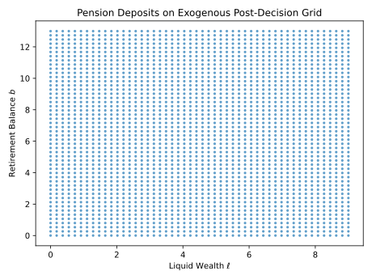
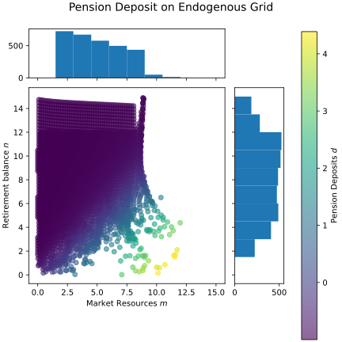
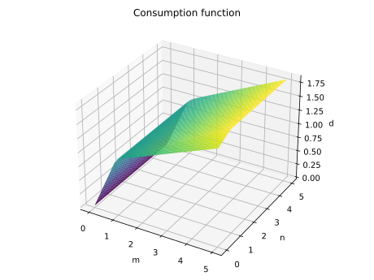

## Motivation

- Structural Economics for modeling **decision-making under uncertainty**
  - household: consumption, savings, labor, portfolio, retirement
  - firms: production, investment, hiring, entry/exit
  - governments: fiscal and monetary policy, taxation, redistribution
  - interdisciplinary: climate change, public health, education, etc.

. . .

- Structural modeling is **hard**
  - modern economics requires solving complex problems
  - with many state variables, many decisions, and non-convexities
  - computationally challenging and time-consuming

\newcommand{\DiscFac}{\beta}
\newcommand{\utilFunc}{\mathrm{u}}
\newcommand{\VFunc}{\mathrm{V}}
\newcommand{\Leisure}{Z}
\newcommand{\tShk}{\xi}
\newcommand{\util}{u}
\newcommand{\tShkEmp}{\theta}
\newcommand{\BLev}{B}
\newcommand{\CLev}{C}
\newcommand{\MLev}{M}
\newcommand{\ALev}{A}
\newcommand{\Ex}{\mathbb{E}}
\newcommand{\CRRA}{\rho}
\newcommand{\labShare}{\nu}
\newcommand{\leiShare}{\zeta}
\newcommand{\h}{h}
\newcommand{\bRat}{b}
\newcommand{\leisure}{z}
\newcommand{\cRat}{c}
\newcommand{\PLev}{P}
\newcommand{\vFunc}{\mathrm{v}}
\newcommand{\Rfree}{\mathsf{R}}
\newcommand{\wage}{\mathsf{w}}
\newcommand{\riskyshare}{\varsigma}
\newcommand{\PGro}{\Gamma}
\newcommand{\labor}{\ell}
\newcommand{\aRat}{a}
\newcommand{\mRat}{m}
\newcommand{\Rport}{\mathbb{R}}
\newcommand{\Risky}{\mathbf{R}}
\newcommand{\risky}{\mathbf{r}}
\newcommand{\vOpt}{\tilde{\mathfrak{v}}}
\newcommand{\vEnd}{\mathfrak{v}}
\newcommand{\vE}{{v}^{e}}
\newcommand{\vOptAlt}{\grave{\tilde{\mathfrak{v}}}}
\newcommand{\q}{\koppa}
\newcommand{\cEndFunc}{\mathfrak{c}}
\newcommand{\cE}{\cRat^{e}}
\newcommand{\xRat}{x}
\newcommand{\aMat}{[\mathrm{a}]}
\newcommand{\mEndFunc}{\mathfrak{m}}
\newcommand{\mE}{\mRat^{e}}
\newcommand{\mMat}{[\mathrm{m}]}
\newcommand{\tShkMat}{[\mathrm{\tShkEmp}]}
\newcommand{\zEndFunc}{\mathfrak{z}}
\newcommand{\lEndFunc}{\mathfrak{l}}
\newcommand{\bEndFunc}{\mathfrak{b}}
\newcommand{\bE}{\bRat^{e}}
\newcommand{\nRat}{n}
\newcommand{\dRat}{d}
\newcommand{\gFunc}{\mathrm{g}}
\newcommand{\xFer}{\chi}
\newcommand{\lRat}{l}
\newcommand{\wFunc}{\mathrm{w}}
\newcommand{\dEndFunc}{\mathfrak{d}}
\newcommand{\nEndFunc}{\mathfrak{n}}
\newcommand{\uFunc}{\mathrm{u}}
\newcommand{\TFunc}{\mathrm{T}}
\newcommand{\UFunc}{\mathrm{U}}
\newcommand{\WFunc}{\mathrm{W}}
\newcommand{\yRat}{y}
\newcommand{\XLev}{X}
\newcommand{\Retire}{\mathbb{R}}
\newcommand{\Work}{\mathbb{W}}
\newcommand{\error}{\epsilon}
\newcommand{\err}{z}
\newcommand{\kapShare}{\alpha}
\newcommand{\kap}{k}
\newcommand{\cTarg}{\check{c}}
\newcommand{\Decision}{\mathbb{D}}
\newcommand{\Prob}{\mathbb{P}}

## Outline

- Dynamic Programming
  - The Endogenous Grid Method
  - The **Sequential** Endogenous Grid Method
- Functional Approximation
  - Conventional techniques are **insufficient** for complex problems
  - Neural Nets as **function approximators**
  - **Gaussian Process** Regression
- Conclusion
  - Sequential problems are easier to solve
  - GPR is a powerful tool for **interpolation** on unstructured grids

# Dynamic Programming

## A simple consumption-savings problem {auto-animate=true}

Agent maximizes present discounted value (PDV) of lifetime utility

\begin{equation}
\max_{c_t} \sum_{t=0}^{\infty} \DiscFac^t \utilFunc(\cRat_t)
\end{equation}

. . .

Recursive Bellman equation

\begin{equation}
\begin{split}
v_t(\mRat_t) & = \max_{\cRat_t} \utilFunc(\cRat_t) + \DiscFac \Ex_t \left[ v_{t+1}(\mRat_{t+1}) \right] \\
 \text{s.t.} & \quad 0  < \cRat_t \leq \mRat_t \\
\aRat_t & = \mRat_t - \cRat_t \\
 \mRat_{t+1} & = \Rfree \aRat_t + \tShkEmp_{t+1}
\end{split}
\end{equation}

## A simple consumption-savings problem {auto-animate=true}

Recursive Bellman equation

\begin{equation}
\begin{split}
v_t(\mRat_t) & = \max_{\cRat_t} \utilFunc(\cRat_t) + \DiscFac \Ex_t \left[ v_{t+1}(\mRat_{t+1}) \right] \\
 \text{s.t.} & \quad 0  < \cRat_t \leq \mRat_t \\
\aRat_t & = \mRat_t - \cRat_t \\
 \mRat_{t+1} & = \Rfree \aRat_t + \tShkEmp_{t+1}
\end{split}
\end{equation}

How do we solve this problem?

- **Value Function Iteration** (VFI)
  - Discretize state space (interpolation)
  - Grid search optimization (brute force, iterative)

## The Endogenous Grid Method   by @Carroll2006-ag {.smaller}

\begin{equation}
v_t(\mRat_t) = \max_{\cRat_t} \utilFunc(\cRat_t) + \DiscFac \Ex_t \left[ v_{t+1}(\Rfree (\mRat_t - \cRat_t) + \tShkEmp_{t+1}) \right]
\end{equation}

. . .

\begin{equation}
u'(\cRat_t) = \DiscFac \Rfree \Ex_t \left[ v_{t+1}'(\Rfree (\mRat_t - \cRat_t) + \tShkEmp_{t+1}) \right]
\end{equation}

. . .

\begin{equation}
\cEndFunc_t(\aMat) = \utilFunc'^{-1} \left( \DiscFac \Rfree \Ex_t \left[ v_{t+1}'(\Rfree \aMat + \tShkEmp_{t+1}) \right] \right)
\end{equation}

. . .

\begin{equation}
\mEndFunc_t(\aMat) = \cEndFunc_t(\aMat) + \aMat
\end{equation}

. . .

Contribution: $(\mEndFunc_t, \cEndFunc_t) \quad \Rightarrow \quad \hat{\cRat}_t(\mEndFunc_t) = \cEndFunc_t$

- Simple: **Inverted Euler** equation
- Fast: No **root-finding** or **grid search** optimization required
- Efficient: Finds **exact solution** at each gridpoint

## Limitations of EGM

- **One-dimensional** problems/sub-problems (nested)
  - (GEGM) @Barillas2007
  - (NEGM) @Druedahl2021
- Can result in **non-rectangular grids**
  - (Curvilinear) @White2015
  - (Triangular) @Ludwig2018
- **Non-convexities** (discrete choices) can be problematic
  - (DCEGM) @Iskhakov2017-af
  - (G2EGM) @Druedahl2017-ac

## EGMn: The Sequential   Endogenous Grid Method {.smaller}

- **Insight**: Problems in which agent makes several **simultaneous choices** can be decomposed into **sequence of problems**
- **Challenge**: Rectilinear exogenous grid results in **unstructured** endogenous grid
- **Solution**: Use machine learning to **interpolate** on unstructured grids

. . .

Contribution:

- **Simple, Fast, Efficient**: Inherits properties of EGM
- **Multi-dimensional**: Can be used for problems with multiple state variables and decisions
- **Cutting-edge**: Functional approximation and uncertainty quantification approach using Gaussian Process Regression

## A consumption - leisure problem {auto-animate=true}

Agent maximizes PDV of lifetime utility

\begin{equation}
\VFunc_0(\BLev_0, \tShkEmp_0) = \max_{\CLev_{t}, \Leisure_{t}} \Ex_{t} \left[ \sum_{t = 0}^{T} \DiscFac^{t} \utilFunc(\CLev_{t}, \Leisure_{t})  \right]
\end{equation}

. . .

Recursive Bellman equation in normalized form:

\begin{equation}
\begin{split}
    \vFunc_{t}(\bRat_{t}, \tShkEmp_{t}) & = \max_{\{\cRat_{t},
      \leisure_{t}\}} \utilFunc(\cRat_{t}, \leisure_{t}) +
    \DiscFac \Ex_{t} \left[ \PGro_{t+1}^{1-\CRRA}
      \vFunc_{t+1} (\bRat_{t+1},
      \tShkEmp_{t+1}) \right] \\
    \labor_{t} & = 1 - \leisure_{t} \\
    \mRat_{t} & = \bRat_{t} + \tShkEmp_{t} \wage \labor_{t} \\
    \aRat_{t} & = \mRat_{t} - \cRat_{t} \\

    \bRat_{t+1} & = \aRat_{t} \Rfree / \PGro_{t+1}
  \end{split}
\end{equation}

## A consumption - leisure problem {auto-animate=true}

Recursive Bellman equation in normalized form:

\begin{equation}
\begin{split}
    \vFunc_{t}(\bRat_{t}, \tShkEmp_{t}) & = \max_{\{\cRat_{t},
      \leisure_{t}\}} \utilFunc(\cRat_{t}, \leisure_{t}) +
    \DiscFac \Ex_{t} \left[ \PGro_{t+1}^{1-\CRRA}
      \vFunc_{t+1} (\bRat_{t+1},
      \tShkEmp_{t+1}) \right] \\
    \labor_{t} & = 1 - \leisure_{t} \\
    \mRat_{t} & = \bRat_{t} + \tShkEmp_{t} \wage \labor_{t} \\
    \aRat_{t} & = \mRat_{t} - \cRat_{t} \\

    \bRat_{t+1} & = \aRat_{t} \Rfree / \PGro_{t+1}
  \end{split}
\end{equation}

where

\begin{equation}
  \utilFunc(\CLev, \Leisure) = \util(\CLev) + \h(\Leisure) = \frac{C^{1-\CRRA}}{1-\CRRA} + \labShare^{1-\CRRA} \frac{\Leisure^{1-\leiShare}}{1-\leiShare}
\end{equation}

## Breaking up the problem into sequences {.smaller auto-animate=true}

Starting from the beginning of the period, we can define the labor-leisure problem as

\begin{equation}
\begin{split}
    \vFunc_{t}(\bRat_{t}, \tShkEmp_{t}) & = \max_{ \leisure_{t}}
    \h(\leisure_{t}) + \vOpt_{t} (\mRat_{t}) \\
    & \text{s.t.} \\
    0 & \leq \leisure_{t} \leq 1 \\
    \labor_{t} & = 1 - \leisure_{t} \\
    \mRat_{t} & = \bRat_{t} + \tShkEmp_{t} \wage \labor_{t}.
  \end{split}
\end{equation}

. . .

The pure consumption-saving problem is then

\begin{equation}
\begin{split}
    \vOpt_{t}(\mRat_{t}) & = \max_{\cRat_{t}} \util(\cRat_{t}) + \DiscFac\vEnd_{t}(\aRat_{t}) \\
    & \text{s.t.} \\
    0 & \leq \cRat_{t} \leq \mRat_{t} \\
    \aRat_{t} & = \mRat_{t} - \cRat_{t}.
  \end{split}
\end{equation}

## Breaking up the problem into sequences {.smaller auto-animate=true}

:::: {.columns}

:::  {.column width="50%"}

Starting from the beginning of the period, we can define the labor-leisure problem as

\begin{equation}
\begin{split}
    \vFunc_{t}(\bRat_{t}, \tShkEmp_{t}) & = \max_{ \leisure_{t}}
    \h(\leisure_{t}) + \vOpt_{t} (\mRat_{t}) \\
    & \text{s.t.} \\
    0 & \leq \leisure_{t} \leq 1 \\
    \labor_{t} & = 1 - \leisure_{t} \\
    \mRat_{t} & = \bRat_{t} + \tShkEmp_{t} \wage \labor_{t}.
  \end{split}
\end{equation}

:::

:::  {.column width="50%"}

The pure consumption-saving problem is then

\begin{equation}
\begin{split}
    \vOpt_{t}(\mRat_{t}) & = \max_{\cRat_{t}} \util(\cRat_{t}) + \DiscFac\vEnd_{t}(\aRat_{t}) \\
    & \text{s.t.} \\
    0 & \leq \cRat_{t} \leq \mRat_{t} \\
    \aRat_{t} & = \mRat_{t} - \cRat_{t}.
  \end{split}
\end{equation}

:::

::::

Finally, the post-decision value function is

\begin{equation}
\begin{split}
    \vEnd_{t}(\aRat_{t}) & =
    \Ex_{t} \left[ \PGro_{t+1}^{1-\CRRA}
      \vFunc_{t+1}(\bRat_{t+1},
      \tShkEmp_{t+1}) \right] \\
    & \text{s.t.} \\
    \bRat_{t+1} & = \aRat_{t} \Rfree / \PGro_{t+1}.
  \end{split}
\end{equation}

## Solving Labor-Leisure (EGM, Again)

We can condense the labor-leisure problem into a single equation:

\begin{equation}
\vFunc_{t}(\bRat_{t}, \tShkEmp_{t}) = \max_{ \leisure_{t}}
  \h(\leisure_{t}) + \vOpt_{t}(\bRat_{t} +
  \tShkEmp_{t} \wage (1-\leisure_{t}))
\end{equation}

. . .

Interior solution must satisfy the first-order condition:

\begin{equation}
\h'(\leisure_{t}) = \vOpt_{t}'(\mRat_{t})  \tShkEmp_{t} \wage
\end{equation}

. . .

EGM consists of inverting the first-order condition to find leisure function:

\begin{equation}
\zEndFunc_{t}(\mMat, \tShkMat) = \h'^{-1}\left(
  \vOpt_{t}'(\mMat) \wage \tShkMat \right)
\end{equation}

## Solving Labor-Leisure (EGM, Again)

Using market resources condition we obtain endogenous grid:

$$\bEndFunc_{t}(\mMat, \tShkMat) = \mMat -
  \tShkMat\wage(1-\zEndFunc_{t}(\mMat, \tShkMat))$$

. . .

So now we have the triple $(\zEndFunc_t, \bEndFunc_t, \tShkEmp)$, where $\zEndFunc_t$ is the unconstrained approx. of optimal leisure for each $(\bEndFunc_t, \tShkEmp)$ corresponding to  each $(\mMat, \tShkMat)$. Generally, we can construct an interpolator as follows:

$$\leisure_t(\bEndFunc_t, \tShkEmp) = \zEndFunc_t$$

. . .

Actual leisure function is bounded between 0 and 1:

\begin{equation}
\hat{\leisure}_{t}(\bRat, \tShkEmp) = \max \left[ \min \left[ \leisure_{t}(\bRat, \tShkEmp), 1 \right], 0 \right]
\end{equation}

## Pretty Simple, Right?

What is the **problem**?

. . .

<table><tr><td>
  Exogenous Rectangular Grid  
  
  </td><td>
  Endogenous Curvilinear Grid  
  
</td></tr></table>

. . .

- **One solution:** Curvilinear Interpolation by @White2015

## Warped Grid Interpolation

- Our solution: **Warped Grid Interpolation** (simpler, faster, more details on paper)

## A more complex problem {.smaller}

Consumption - Pension Deposit Problem as in @Druedahl2017-ac

\begin{equation}
\begin{split}
    \vFunc_{t}(\mRat_{t}, \nRat_{t}) & = \max_{\cRat_{t}, \dRat_{t}} \util(\cRat_{t}) + \DiscFac \Ex_{t} \left[  \vFunc_{t+1}(\mRat_{t+1}, \nRat_{t+1}) \right] \\
    & \text{s.t.} \quad \cRat_{t} > 0, \quad \dRat_{t} \ge 0 \\
    \aRat_{t} & = \mRat_{t} - \cRat_{t} - \dRat_{t} \\
    \bRat_{t} & = \nRat_{t} + \dRat_{t} + g(\dRat_{t}) \\
    \mRat_{t+1} & = \aRat_{t} \Rfree   + \tShkEmp_{t+1} \\
    \nRat_{t+1} & = \bRat_{t} \Risky_{t+1}
  \end{split}
\end{equation}

. . .

where

\begin{equation}
  \uFunc(\cRat) = \frac{\cRat^{1-\CRRA}}{1-\CRRA} \qquad \text{and} \qquad \gFunc(\dRat) = \xFer \log(1+\dRat).
\end{equation}

is a tax-advantaged premium on pension contributions.

## G2EGM from   @Druedahl2017-ac

- If we try to use EGM:
  - 2 first order conditions
  - multiple constraints difficult to handle
  - segments: combinations of first order conditions and constraints
  - $2^{d}$ segments where $d$ is number of control variables
  - requires local triangulation interpolation

## Breaking up the problem makes it easier {.smaller auto-animate=true}

Consider the problem of a consumer who chooses how much to put into a pension account:

\begin{equation}
\begin{split}
    \vFunc_{t}(\mRat_{t}, \nRat_{t}) & = \max_{\dRat_{t}} \vOpt_{t}(\lRat_{t}, \bRat_{t}) \\
    & \text{s.t.}  \quad 0 \le \dRat_{t} \le \mRat_t \\
    \lRat_{t} & = \mRat_{t} - \dRat_{t} \\
    \bRat_{t} & = \nRat_{t} + \dRat_{t} + g(\dRat_{t})
  \end{split}
\end{equation}

. . .

After, the consumer chooses how much to consume out of liquid savings:

\begin{equation}
\begin{split}
    \vOpt_{t}(\lRat_{t}, \bRat_{t}) & = \max_{\cRat_{t}} \util(\cRat_{t}) + \DiscFac \wFunc_{t}(\aRat_{t}, \bRat_{t})  \\
    & \text{s.t.} \quad 0 < \cRat_{t} \le \mRat_t
     \\
    \aRat_{t} & = \lRat_{t} - \cRat_{t}
  \end{split}
\end{equation}

## Breaking up the problem makes it easier {.smaller auto-animate=true}

:::: {.columns}

:::  {.column width="50%"}

Consider the problem of a consumer who chooses how much to put into a pension account:

\begin{equation}
\begin{split}
    \vFunc_{t}(\mRat_{t}, \nRat_{t}) & = \max_{\dRat_{t}} \vOpt_{t}(\lRat_{t}, \bRat_{t}) \\
    & \text{s.t.}  \quad 0 \le \dRat_{t} \le \mRat_t \\
    \lRat_{t} & = \mRat_{t} - \dRat_{t} \\
    \bRat_{t} & = \nRat_{t} + \dRat_{t} + g(\dRat_{t})
  \end{split}
\end{equation}

:::

:::  {.column width="50%"}

After, the consumer chooses how much to consume out of liquid savings:

\begin{equation}
\begin{split}
    \vOpt_{t}(\lRat_{t}, \bRat_{t}) & = \max_{\cRat_{t}} \util(\cRat_{t}) + \DiscFac \wFunc_{t}(\aRat_{t}, \bRat_{t})  \\
    & \text{s.t.} \quad 0 < \cRat_{t} \le \mRat_t
     \\
    \aRat_{t} & = \lRat_{t} - \cRat_{t}
  \end{split}
\end{equation}

:::

::::

And the post-decision value function is defined as:

\begin{equation}
\begin{split}
  \wFunc_t(a_t, b_t) & = \Ex_{t} \left[ \vFunc_{t+1}(\mRat_{t+1}, \nRat_{t+1}) \right] \\
  & \text{s.t.} \\
  \mRat_{t+1} & = \aRat_{t} \Rfree   + \tShkEmp_{t+1} \\
  \nRat_{t+1} & = \bRat_{t} \Risky_{t+1}
\end{split}
\end{equation}

## Breaking up the problem makes it easier {.smaller auto-animate=true}

:::: {.columns}

:::  {.column width="50%"}

Consider the problem of a consumer who chooses how much to put into a pension account:

\begin{equation}
\begin{split}
    \vFunc_{t}(\mRat_{t}, \nRat_{t}) & = \max_{\dRat_{t}} \vOpt_{t}(\lRat_{t}, \bRat_{t}) \\
    & \text{s.t.}  \quad 0 \le \dRat_{t} \le \mRat_t \\
    \lRat_{t} & = \mRat_{t} - \dRat_{t} \\
    \bRat_{t} & = \nRat_{t} + \dRat_{t} + g(\dRat_{t})
  \end{split}
\end{equation}

:::

:::  {.column width="50%"}

After, the consumer chooses how much to consume out of liquid savings:

\begin{equation}
\begin{split}
    \vOpt_{t}(\lRat_{t}, \bRat_{t}) & = \max_{\cRat_{t}} \util(\cRat_{t}) + \DiscFac \wFunc_{t}(\aRat_{t}, \bRat_{t})  \\
    & \text{s.t.} \quad 0 < \cRat_{t} \le \mRat_t
     \\
    \aRat_{t} & = \lRat_{t} - \cRat_{t}
  \end{split}
\end{equation}

:::

::::

:::: {.columns}

::: {.column width="50%"}

And the post-decision value function is defined as:

\begin{equation}
\begin{split}
  \wFunc_t(a_t, b_t) & = \Ex_{t} \left[ \vFunc_{t+1}(\mRat_{t+1}, \nRat_{t+1}) \right] \\
  & \text{s.t.} \\
  \mRat_{t+1} & = \aRat_{t} \Rfree   + \tShkEmp_{t+1} \\
  \nRat_{t+1} & = \bRat_{t} \Risky_{t+1}
\end{split}
\end{equation}

:::

::: {.column width="50%"}

Steps:

1. Compute $\wFunc_t(a_t, b_t)$
2. Solve consumption problem (EGM)
3. Solve pension problem (EGM, again)
4. Done!

:::

::::

## Solving the pension problem {.smaller auto-animate=true}

The pension problem, more compactly

\begin{equation}
\vFunc_{t}(\mRat_{t}, \nRat_{t}) = \max_{\dRat_{t}}
  \vOpt_{t}(\mRat_{t} - \dRat_{t}, \nRat_{t} + \dRat_{t} + \gFunc(\dRat_{t}))
\end{equation}

. . .

Interior solution must satisfy the first-order condition:

\begin{equation}
\gFunc'(\dRat_{t}) = \frac{\vOpt_{t}^{\lRat}(\lRat_{t},
    \bRat_{t})}{\vOpt_{t}^{\bRat}(\lRat_{t}, \bRat_{t})} - 1
\end{equation}

. . .

Inverting, we can obtain the optimal choice of $\dRat_{t}$:

\begin{equation}
\dEndFunc_{t}(\lRat_{t}, \bRat_{t}) = \gFunc'^{-1}\left(
  \frac{\vOpt_{t}^{\lRat}(\lRat_{t},
    \bRat_{t})}{\vOpt_{t}^{\bRat}(\lRat_{t},
    \bRat_{t})} - 1 \right)
\end{equation}

## Solving the pension problem {.smaller auto-animate=true}

Inverting, we can obtain the optimal choice of $\dRat_{t}$:

\begin{equation}
\dEndFunc_{t}(\lRat_{t}, \bRat_{t}) = \gFunc'^{-1}\left(
  \frac{\vOpt_{t}^{\lRat}(\lRat_{t},
    \bRat_{t})}{\vOpt_{t}^{\bRat}(\lRat_{t},
    \bRat_{t})} - 1 \right)
\end{equation}

Using resource constraints we obtain endogenous grids:

\begin{equation}
  \nEndFunc_{t}(\lRat_{t}, \bRat_{t}) = \bRat_{t} -
  \dEndFunc_{t}(\lRat_{t}, \bRat_{t}) - \gFunc(\dEndFunc_{t}(\lRat_{t},
    \bRat_{t})) \\
  \mEndFunc_{t}(\lRat_{t}, \bRat_{t}) = \lRat_{t} +
  \dEndFunc_{t}(\lRat_{t}, \bRat_{t})
\end{equation}

. . .

Now we have the triple $\{\mEndFunc_t, \nEndFunc_t, \dEndFunc_t\}$ where $\dEndFunc_t$ is the unconstrained approx. of optimal deposit for each $(\mEndFunc_t, \nEndFunc_t)$ corresponding to  each $(\lRat_t, \bRat_t)$. Generally, we can construct an interpolator as follows:

\begin{equation}
\hat{\dRat_t}(\mEndFunc_t, \nEndFunc_t) = \begin{cases}
0 & \text{if } \dEndFunc_t < 0 \\
\dEndFunc_t & \text{if } 0 \le \dEndFunc_t \le \mEndFunc_t \\
\mEndFunc_t & \text{if } \dEndFunc_t > \mEndFunc_t
\end{cases}
\end{equation}

## Unstructured Grids {.smaller}

Problem: **Rectilinear** exogenous grid results in **unstructured** endogenous grid

:::: {.columns}

::: {.column width="50%"}

Exogenous Rectangular Grid  

:::

::: {.column width="50%"}

Endogenous Unstructured Grid  

:::

::::

How do we **interpolate** on this grid?

# Functional Approximation

## Linear Interpolation on a Uniform Grid



## Linear Interpolation on a Non-linear Grid



## Bilinear Interpolation



## Curvilinear (Warped) Grid Interpolation {.smaller}



See: @White2015

## What about Unstructured Grids? {.smaller}



See: @Ludwig2018

## Artificial Neural Networks {auto-animate=true}

{height=5.5in}

## Artificial Neural Networks {auto-animate=true}

:::: {.columns}

::: {.column width="40%"}

:::

::: {.column width="60%"}

- Based on biological neural pathways (neurons in a brain)
- Learns function $f(X): R^n \rightarrow R^m$
- Consists of
  - input (features) $X$
  - hidden layers $g(\cdots)$
  - output (target) $y = f(X)$
- Hidden layers can have many nodes
- Neural nets can have many hidden layers (deep learning)
:::

::::

## A single neuron, and a bit of math {auto-animate=true}

{width=50%}

\begin{equation}
y = g(w_0 + \sum_{i=1}^n w_i x_i) = g(w_0 + \mathbf{x}' \mathbf{w})
\end{equation}

## A single neuron, and a bit of math {auto-animate=true}

:::: {.columns}

::: {.column width="30%"}

:::

::: {.column width="70%"}

\begin{equation}
y = g(w_0 + \sum_{i=1}^n w_i x_i) = g(w_0 + \mathbf{x}' \mathbf{w})
\end{equation}

:::

::::

. . .

:::: {.columns}

::: {.column width="60%"}

- $y$ is the output or target
- $x_i$ are the inputs or features
- $w_0$ is the bias
- $w_i$ are the weights

:::

::: {.column width="40%"}

- $g(\cdot)$ is the activation function (non-linear)
\begin{equation}
g(z) = \frac{1}{1 + e^{-z}}
\end{equation}
- usually a sigmoid, but there are many others

:::

::::

## Training a Neural Network {auto-animate=true}

Mean Squared Error (MSE)

\begin{equation}
J(\mathbf{w}) = \frac{1}{2n} \sum_{i=1}^n \left[y_i - f(\mathbf{x}^{(i)}; \mathbf{w})\right]^2
\end{equation}

. . .

Objective

\begin{equation}
\mathbf{w}^* = \arg \min_{\mathbf{w}} J(\mathbf{w})
\end{equation}

## Training a Neural Network {auto-animate=true}

:::: {.columns}

::: {.column width="60%"}

Mean Squared Error (MSE)

\begin{equation}
J(\mathbf{w}) = \frac{1}{2n} \sum_{i=1}^n \left[y_i - f(\mathbf{x}^{(i)}; \mathbf{w})\right]^2
\end{equation}

:::

::: {.column width="40%"}

Objective

\begin{equation}
\mathbf{w}^* = \arg \min_{\mathbf{w}} J(\mathbf{w})
\end{equation}

:::

::::

Gradient Descent

\begin{equation}
\mathbf{w}^{(t+1)} = \mathbf{w}^{(t)} - \eta \nabla J(\mathbf{w}^{(t)})
\end{equation}

## Training a Neural Network {auto-animate=true}

:::: {.columns}

::: {.column width="60%"}

Mean Squared Error (MSE)

\begin{equation}
J(\mathbf{w}) = \frac{1}{2n} \sum_{i=1}^n \left[y_i - f(\mathbf{x}^{(i)}; \mathbf{w})\right]^2
\end{equation}

:::

::: {.column width="40%"}

Objective

\begin{equation}
\mathbf{w}^* = \arg \min_{\mathbf{w}} J(\mathbf{w})
\end{equation}

:::

::::

Stochastic Gradient Descent

\begin{equation}
\widetilde{\nabla} J(\mathbf{w}^{(t)}) = \frac{1}{B} \sum_{i=1}^B \nabla J_i(\mathbf{w}^{(t)})
\end{equation}

\begin{equation}
\mathbf{w}^{(t+1)} = \mathbf{w}^{(t)} - \eta \widetilde{\nabla} J(\mathbf{w}^{(t)})
\end{equation}

## Gaussian Process Regression

A Gaussian Process is a **probability distribution over functions**

\begin{equation}
\begin{gathered}
    f(x) \sim \mathcal{GP}(m(x), k(x, x')) \\
    \text{where} \quad m(x) = \mathbb{E}[f(x)] \\
    \text{and} \quad k(x, x') = \mathbb{E}[(f(x) - m(x))(f(x') - m(x'))]
  \end{gathered}
\end{equation}

. . .

A Gaussian Process **Regression** is used to find the function that **best fits** a set of data points

\begin{equation}
\mathbb{P}(\mathbf{f} | \mathbf{X}) = \mathcal{N}(\mathbf{f} | \mathbf{m}, \mathbf{K})
\end{equation}

. . .

I use standard covariance function, exploring alternatives is an active area of research

\begin{equation}
k(\mathbf{x}_i, \mathbf{x}_j) = \sigma^2_f \exp\left(-\frac{1}{2l^2} (\mathbf{x}_i - \mathbf{x}_j)' (\mathbf{x}_i - \mathbf{x}_j)\right).
\end{equation}

## Approximation

::: {.callout-note}

**Gaussian Processes**

- mathematically equivalent to **neural networks** with an **infinite width**
- do not require **as much data** as neural networks
- offers **uncertainty quantification** of the mean function
- can be used to **approximate** any function **arbitrarily closely**

:::

::: {.callout-tip}

## Universal Approximation Theorem

A single hidden-layer ANN can **approximate** any continuous function **arbitrarily closely** as the number of neurons in the hidden layer **increases**.

:::

## An example

Consider the true function $f(x) = x \cos(1.5x)$ sampled at random points

## An example

A random sample of the GP posterior distribution of functions

## An example {.smaller}

Gaussian Process Regression finds the function that best fits the data

. . .

- **Gaussian Process Regression** gives us
  - **Mean** function of the posterior distribution
  - **Uncertainty quantification** of the mean function
  - Can be useful to predict where we might need **more points** and update the grid

## Back to the model

Second Stage Pension Endogenous Grid

:::: {.columns}

::: {.column width="50%"}

:::

::: {.column width="50%"}

:::

::::

## Some Results

:::: {.columns}

::: {.column width="50%"}

Consumption Function  

:::

::: {.column width="50%"}

Deposit Function  

:::

::::

# Conclusion

## Conditions for using Sequential EGM {.smaller}

- Model must be
  - concave
  - differentiable
  - continuous
  - separable

. . .

Need an **additional** function to exploit **invertibility**

. . .

Examples in this paper:

- Separable utility function
  - $\uFunc(\cRat, \leisure) = \uFunc(\cRat) + \h(\leisure)$
- Continuous and differentiable transition
  - $\bRat_{t}  = \nRat_{t} + \dRat_{t} + g(\dRat_{t})$

## Resources

- An Introduction to Statistical Learning [`statlearning.com`](https://www.statlearning.com/){target="_blank"}
- Neural Networks and Deep Learning [`neuralnetworksanddeeplearning.com`](http://neuralnetworksanddeeplearning.com/){target="_blank"}
- Deep Learning [`deeplearningbook.org`](https://www.deeplearningbook.org){target="_blank"}
- Probabilistic machine learning  [`probml.github.io/pml-book`](https://probml.github.io/pml-book){target="_blank"}
- A Neural Network Playground [`playground.tensorflow.org`](https://playground.tensorflow.org){target="_blank"}
- The Gaussian Process Web Site [`gaussianprocess.org`](http://www.gaussianprocess.org){target="_blank"}
- A Visual Exploration of Gaussian Processes [`distill.pub/2019`](https://distill.pub/2019/visual-exploration-gaussian-processes){target="_blank"}
- Interactive Gaussian Process Visualization
 [`http://www.infinitecuriosity.org/vizgp`](http://www.infinitecuriosity.org/vizgp){target="_blank"}

## Thank you! {.center}

[`engine: github.com/econ-ark/HARK`](https://github.com/econ-ark/HARK){target="_blank"}

[`code: github.com/alanlujan91/SequentialEGM`](https://github.com/alanlujan91/SequentialEGM){target="_blank"}

[`website: alanlujan91.github.io/SequentialEGM/egmn`](https://alanlujan91.github.io/SequentialEGM/egmn){target="_blank"}

## References {.smaller}

::: {#refs}
:::
